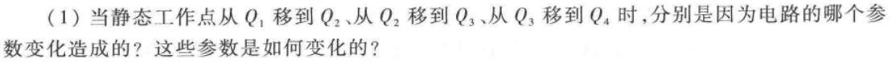
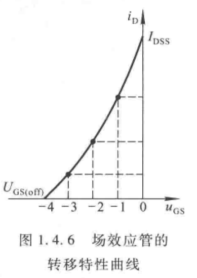

# 半导体
> ###  N型半导体（代表多子是电子）
 * 掺杂磷（P）
 > ###  P型半导体（代表多子是空穴）
 * 掺杂硼（B）
> * 多子的浓度是决定半导体导电能力的参数
>* 温度对少子的影响远远大于对多子的影响，所以少子浓度的变化是影响半导体材料温度稳定性的最主要的因素
#### PN结
* 扩散运动
> 多子的浓度差
* 漂移运动
> 电场作用

参与扩散运动和漂移运动的载流子数目相同，达到动态平衡，就形成了PN结。
#### PN结的电容效应
# 二极管
二极管的伏安特性曲线

$$i=I_s(e^{\frac{u}{U_T}}-1) ， (常温下U_T（温度的电压当量）=26mV)$$
* $若电压u>>U_T，i\approx I_se^{\frac{u}{U_T}}$
* $若电压u<<-U_T，i\approx -I_s$

>* 温度升高，正向特性曲线右移，反向特性曲线下移
即管压降下降，击穿电压降低，反向饱和电流增加（每10℃增加一倍）

#### 反向击穿电压类型
> 电击穿： PN结未烧毁，断电即恢复。
热击穿：PN结烧毁。
#### 反向击穿原因
>  齐纳击穿：反向电场太强，将电子强行拉出共价键。 (击穿电压 < 6 V)
 雪崩击穿：反向电场使电子加速，动能增大，撞击使自由电子数突增。(击穿电压 > 6 V)
 # 三极管
 ### 三极管放大的条件
 > 内部条件
 * 发射区掺杂浓度高
 * 基区薄且掺杂浓度低
 * 集电极面积大
 > 外部条件
 * 发射结正偏
 * 集电结反偏
 
 #### 三极管电流分配关系
 
 $$I_E=I_{EN}+I_{EP}=I_{BN}+I_{CN}+I_{EP}$$
 $$I_B=I_{BN}+I_{EP}-I_{CBO} $$
 $$I_C=I_{CN}+I_{CBO}$$
 $I_{EN}是发射结正向偏置，由发射区向基区扩散的电子电流$
 $其中一小部分电子与基区空穴复合产生I_{BN}电流$
 $基区内的大部分非平衡少子向集电区"漂移"现成电流I_{CN}$
 （"漂移"，即电场作用，即集电区电压大于基区电压）
 同时基区有少子的漂移运动，即形成$I_{EP}$
 基区和集电区的平衡少子的漂移运动形成$I_{CBO}电流$
 $$I_E=I_C+I_B$$
 $$I_C=\beta I_B$$
 $$ I_{CEO}=(1+\beta I_{CBO})$$
 $I_{CEO}$是穿透电流，是当$I_B=0$时，在集电极电源$V_{cc}$作用下的集电极与发射极之间的电流，而$I_{CBO}$,是$I_E=0$时，集电结的反向饱和电流.这两个电流都是平衡少子的漂移运动产生，所以更易受温度影响。
 #### 输入特性曲线
 
 * 当$V_{CE}=0$时，集电极与发射极短路，即集电极与发射极并联，所以输入特性曲线和PN结一样。
 * 当$V_{CE}$增大时，，由发射区注入基区的非平衡少子一部分越过基区和集电结形成电流$I_C$,使得基区参与复合运动的非平衡少子随$U_{CE}$的增大而减小，因此在同样的$V_{BE}$下，随$U_{CE}$的增大，$i_b$减小，因此图像右移。  
 * 但是对于确定的$V_{BE}$,$V_{CE}$增大到一定程度后，$I_C$趋于稳定，不会在变化了，因为大部分的非平衡少子已经漂移到集电区，已经稳态了。所以对于小功率管，$V_CE$大于$1V$的一条输入特性曲线可以取代$V_CE$大于$1V$的所有输入特性曲线。
 #### 输出特性曲线
 
 在满足$V_B>V_on$，且$I_B\neq0$的情况下，只需要再满足基区的大部分非平衡少子通过漂移运动到集电区形成I_C电流即完成放大，如果不能，就是在饱和区。放大区的$I_C=\beta I_B,I_C$电流受$I_B$控制，在饱和区的$I_C$受电压$V_{CE}$控制，随电压变化很大。放大区内的静态工作点要根据具体电路确定。
### 极限参数
* 最大集电极耗散功率$P_{CM}(=i_c*u_{ce})$

$P_{CM}$决定晶体管的温升，硅管-150℃，锗管-70℃，当温度超过时，管子特性明显变坏，甚至烧毁。
* 最大集电极电流$I_{CM}$
$I_C$在一定范围内，$\beta$ 不会变化，当$I_C$增大到$\beta$明显减小时，即为$I_{CM}$。
* 极间反向击穿电压
>当晶体管某一级开路时，另外两个电极之间所允许加的最高反向电压。

U_{CBO}是发射极开路，集电极与基极的反向击穿电压，这是集电极所允许添加的最高反向电压。
U_{CEO}是基极开路，集电极与发射极之间的反向击穿电压，集电结承受反向电压。
### 温度对晶体管的影响
#### 输出特性曲线
和PN结的一样

#### 输出特性曲线
温度升高，$I_{CBO}$和$I_{CEO}$增大（因为这两个电流是由平衡少子的漂移运动产生），则$I_C$电流增大，且$\beta$也会增大。

>集电极电流增大还有一个原因是因为温度升高，使得输入特性曲线左移，$I_B$电流增大，即$I_C$电流也会增大
### 基本共射放大电路

* 静态工作点Q的表达式

**常用的共射放大电路**

>**通过改变R_b和R_c来改变V_BE和V_CE两端之间的电压，进而控制晶体管的开启和闭合，同时还可以改变I_B和I_C的电流，进而改变静态工作点，使输出放大不失真。**
### 放大电路的分析
分别画出直流通路和交流通路

再分别画出负载线

**由图可知，当电压V_{CE}一定，可以通过改变I_c、I_b、R_c、R_L来改变静态工作点，使输出放大且不失真**

#### 等效电路模型
小信号h参数等效模型

$$r_{be}\approx 200R+(1+\beta)\frac{U_T}{I_{EQ}}=200R+(1+\beta)\frac{26mV}{I_{EQ}}$$

* 电压放大倍数$\dot{A_u}$
$$\dot{A_u}=\frac{\dot{U_o}}{\dot{U_i}}=\frac{\dot{-I_c}R_c}{\dot{I_b}(R_b+r_{be})}=\frac{\dot{-\beta\dot{I_b}}R_c}{\dot{I_b}(R_b+r_{be})}=-\frac{\beta R_c}{R_b+r_{be}}$$
* 输入输出电阻不包括负载电阻$R_c$和信号源内阻$r_i$
### 静态工作点的稳定

在电阻$R_{b1}$和$R_{b2}$的分压下，$U_B$的电压保存不变，当温度升高时，$I_c$增大，即$I_e$增大，$U_E$增大，又因为$B$点电位不变，所以$U_{BE}$减小，$I_B$减小，导致$I_C$减小，即完成负反馈。
>即由于$R_e$的存在，在电路中加入负反馈，使静态工作点保持稳定，即$R_e$也叫做直流负反馈电阻
> $R_e$越大，负反馈越强，但是$R_e$不能无限大，会导致三极管进入饱和区。

$I_2=I_1+I_{BQ}$，只有当$I_1>>I_{BQ}$时，$B$点的电压才等于$R_1和R_2$的分压（因为近似看成串联电路分压），而只有$(1+\beta)R_e>>R_1//R_2$,条件$I_1>>I_{BQ}$才成立。

当没有电容C时，电压增益变得很小，但是Q点的稳定性大大增加，所以在电路中，会将R_e分成两部分，

满足$R_f<R_e$ 

# 场效应管
## 结型场效应管

**结型场效应管在没有外加反向电压的情况下就可以导通，自带导电沟道，所以对结型场效应管的使用是加反向电压控制截止**

$U_{GS(off)}$是夹断电压，此时$U_{DS}=0$，确定的$U_{GS}$有固定的导电沟道，当$U_{DS}>0$时，将会产生漏极电流$I_d$，同时沟道中个点与栅极电压不在相等，$U_{GD}=U_{GS}-U_{DS}$，随着$U_{DS}$不断增大，$U_{GD}$不断减小，靠近漏极的导电沟道必将变窄，如图：,当$U_{GD}=U_{GS(off)}$时，为预夹断，从此时到完全夹断，电流不在受$U_{DS}$电压变化而变化，漏极电流$I_d$不变，即恒流，仅受电压U_{GS}控制。在$U_{GD}<U_{GS}$，即$U_{DS}>U_{GS}-U_{GS(off)}$时，漏极电流$I_d$仅受$U_{GS}$的变化而变化，即电压控制电流。
> g_m为低频跨导,用来描述栅源电压对漏极电流的控制作用
$$g_m=\frac{\Delta i_D}{\Delta u_{GS}}(U_{GS}是个常量)$$
* 在$U_{GD}=U_{GS}-U_{DS}>U_{GS(off)}$时，即当$U_{DS}<U_{GS}-U_{GS(off)}$（未出现预夹断）时，漏极电流$I_d$随$U_{DS}$变化而变化
* 当$U_{GD}=U_{GS(off)}$时，预夹断
* 当$U_{GD}< U_{GS(off)} $ 时，漏极电流$I_d $ 仅取决于$U_{GS}$，与$U_{DS}$无关，进入恒流区。
* 当$U_{GS}< U_{GS(off)}$时，管子夹断，电流为0；
### 输出特性曲线

### 转移特性曲线（即输入电压与输出电流之间的关系）

恒流区$i_D$的表达式
$$i_D=I_{DSS}(1-\frac{U_{GS}}{U_{GS(off)}})^2$$
$I_{DSS}$为饱和漏极电流