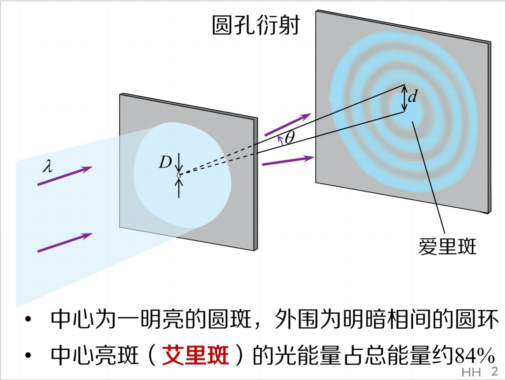

# ***物理***
>## 光的衍射
衍射现象的实质是子波的干涉
>两类衍射
* 菲涅尔衍射：光源和（或）观察屏距离障碍物有限远
* 夫朗禾费衍射：光源及观察屏距离障碍物均为无限远
> ### 1.单缝衍射
 特点：
>* 中央明纹很宽很亮
>* 两侧明暗条纹间隔对称分布
>* 暗纹很窄，明纹很宽

> ### 2.圆孔衍射

由image-19得，sin($\theta$)=$\lambda$/D(D是圆孔直径，$\lambda$ 是光线波长)
当 $\theta$ 很小时，sin($\theta$) $\approx$ $\theta$, $\theta$ = $\lambda$ /D=d(半径)/S(圆孔与投影间得距离)
由image-21得，sin($\theta$/2)=l/2/S
由于 $\theta$/2很小，所以sin($\theta$\2) $\approx$ $\theta$/2,
即 $\theta$/2=l/2/S
即 $\theta$ =l/S
即，当 $\theta$ 对应得角度为半角时，$\theta$ 就等于半径/距离
当 $\theta$ 对应得角度为全角时， $\theta$ 就等于直径/距离

> ### 3.光栅衍射

> #### 光栅衍射的本质：多个单缝衍射+子波干涉

> $$ asin\theta=\pm k'\lambda$$ 是单缝衍射的暗纹，当单缝衍射的某一级暗纹使得$\frac{d}{a}$为整数时，对应的光栅衍射某一级主极大缺极

> ### X光衍射

# 热学
## 理想气体压强与温度
>### 理想气体压强公式
压强$$p=\frac{1}{3}nm_0\overline{v^2}$$，n是分子总数
分子平均平动动能$$ \overline{\epsilon_t} = \frac{1}{2} m_0 v^2 $$ 
理想气体压强 $$p=\frac{2}{3}n\overline{\epsilon_t}=\frac{1}{3}\rho\overline{v^2}$$
因为$$ p=nKT$$
所以$$ \overline{\epsilon_t} =\frac{1}{2}m_0\overline{v^2}=\frac{3}{2}kT$$
方均根速率 $$\sqrt{\overline{v^2}}=\sqrt{\frac{3KT}{m_0}}=\sqrt{\frac{3RT}{M}}=\sqrt{\frac{3p}{\rho}}$$
* 温度是分子热运动剧烈程度的量度
* 温度是描述热力学系统平衡态的一个物理量，对于处在非平衡态的系统，不能用温度来描述状态
* 温度只能用来描述大量分子的集体状态，对单个分子是毫无意义的
* 温度所反应的运动是无规则的平动动能，与物理的机械运动无关
## 麦克斯韦速率分布规律

>分布函数（速率v附近单位速率区间内的分子数占分子总数的比值）
$$ f(v)=\frac{d_N}{Nd_v}
，N是分子总数，d_N是v附近区间[v,v+d_v]内的分子数 $$

* $$ f(v)=4\pi(\frac{m_0}{2\pi KT})^\frac{3}{2}v^2exp(-\frac{m_0v^2}{2KT})$$
最概然速率, 令$$\frac{df(v)}{d_v}=0$$
$$v_P=\sqrt{\frac{2KT}{m_0}}$$

平均速率 $$\overline{v}=\int_0^\infty vf(v)d_v $$
$$ \overline{v}=\sqrt{\frac{8KT}{\pi m_0}}=\sqrt{\frac{8RT}{\pi M}}$$
速率的平方的平均值 $$\overline{v^2}=\int_0^\infty v^2f(v)d_v $$
$$ \sqrt{\overline{v^2}}=\sqrt{\frac{3KT}{m_0}}=\sqrt{\frac{3RT}{M}} $$
方均根速率 $$\sqrt{\overline{v^2}}=\sqrt{\int_0^\infty v^2f(v)d_v} $$

## 能量均分定理
> 自由度，为了描述物体的运动或者确定他的空间位置和方向所需要的独立坐标的个数

