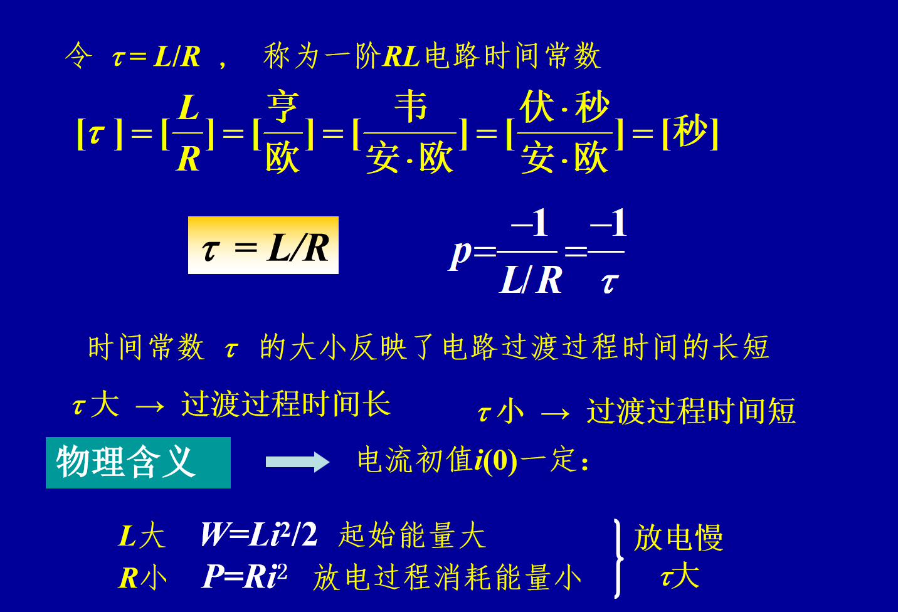

# 电路
## 含耦合电感电路
> ### 互感
$$ 定义磁链\psi=N\phi(N是匝数、\phi是磁通) $$
$$空心线圈的\psi与i成正比，当只有一个线圈时：\psi_1=\psi_ {11}=L_1i_1$$
L_1是自感系数，单位亨（H）。
 ## 一阶电路
 
由KVL得，Ri+U_L=U_s，所以Ri+L\frac{d_i}{d_t}=U_s

由$KVL$得，$Ri+U_c=U_s，所以RC\frac{d_u}{d_t}+U_c=U_s$

>就根据电感两端电流不变和电容两端电压不变解题。
### 电容一阶零输入响应
当电容放电时，

$-RC\frac{d_u}{d_t}+U_c=0$
解得
$$U_c（t）=U_0e^{-\frac{t}{RC}}$$
$$i=\frac{U_0}{R}e^{-\frac{1}{RC}}$$

### 电感一阶零输入响应

$$i(t)=I_0e^{-\frac{Rt}{L}},t>=0$$
$$ u_L(t)=L\frac{d_{iL}}{d_t}=-RI_0e^{-\frac{Rt}{L}}$$
](image-113.png)
### 电容一阶零状态响应
