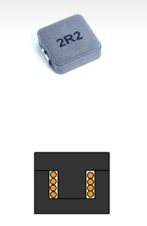

# 选型
 ## 1.电感

* ### ***参数*** 
>### 饱和电流 Isat
* (一般是电感值衰减至30%时的偏置电流)
* 随着电流增加电感的磁导率是慢慢下降的，而电感量是与磁导率成正比的，所以电感量是随电流增加而减小的，当电感饱和时，电感器就失去了作用。
> ### 温升电流 Irms
* （一般是值电感温度升温不超过40时的电流）
* 当温度高于居里点（又作居里温度或磁性转变点）时，该物质变为顺磁体，磁体的磁场很容易随周围磁场的变化而变化，导致磁导率下降。
> ### 额定电流 Irat
* 电感最终的额定电流，是饱和电流或温升电流中的小者。
### ==在电路设计中，电感的额定电流要超过电感最大电流的1.25倍，即留20%的裕量。==
* ### ***电感类型（pcb的不同处理）***
* #### 工字形电感
> 磁路闭合，电磁泄漏较多

* #### 半封闭电感
> 电磁泄漏较少

* #### 一体成型电感
> 电磁泄漏最少

### pcb设计<u>
 * 电感下方任何一层都不能走线，应该覆铜成为地平面，最多是较粗的电源线，信号线要远离电感
* 泄漏较小的磁屏蔽电感下方铜箔应该保留，并与地连通，以屏蔽电感泄漏的电磁波，完整的地平面也限制了涡流产生的干扰范围
* 泄漏较大的电感涡流会较大，应该挖空电感下方铜箔，但只能挖一层，保留其他层的地，不可以所有层全部挖空（会为各层信号线带来干扰，没有阻挡），一方面屏蔽电磁波，另一方面保证地的完整性，挖空的铜箔要有开口，不能形成环路，以免成为天线</u>
---------------------
## 2.三极管
### 参数
-------------------
### 周围物料
* ### 三极管有两种状态，放大和饱和
### 1. 作开关（饱和状态/截止状态）
#### 要确保三极管工作在饱和状态/截止状态，最重要的是选好电路中的电阻

#### 截止状态好保证，即Vbe=0，发射极反向偏置。
#### 那饱和状态呢？
>* (第一种解释)
发射极正偏，集电极反偏，即Vc<0.7v(硅),

或者换句话说，不论硅/锗，由图得，当Vce接近于0时，三极管工作在饱和区
>* (第二种解释)
假设三级管工作在放大状态，放大倍数是β，

$Ic=β* IB$
$Urc=Ic* Rc$
$Uce=Vcc-Urc=Vcc-β*IB*Rc$
当Rb不断减小时，IB不断增大，Uce<0，但是Uce不会小于0，否则电流反偏，即Uce会不断趋近于0，即处于饱和状态。

#### 即当 Vce趋近于0 时，三极管处于饱和态，
NPN型管，in高电平Pmos导通，低电平关断，即三极管处于饱和态，
首先确定R3，$Vce=0$,即$Ic=12/10*10^3=1.2mA$
β最小80，即$Ib=1.2/80=15uA$ 
$R1=(3.3-0.7)/Ib=173K$
即R1可以取10k，因为R3是10K，减少物料。
> ### R2、C1作用
* C1，上电瞬间，电容两端电压不会突变，将Vgs钳位在0v，保证了mos管不会误导通，100nf左右
* R2，在三极管状态改变的时候，Vce会突然变化，C1会进行充放电，<u>R2做Ic的限流电阻</u>  ==如何限的流？==
同时C1和R2构成RC充电电路，可以控制pmos的导通时间。
> ### 但是有两个问题
* ### 三极管的放大倍数β是固定的吗？
* ### 三极管饱和导通时Vc一定是低电平吗？
####  β
> 事实上β随Ic和温度的改变而改变

==当Ic超过100mA时，β急剧下降
当温度升高时，β增大==
####  饱和导通的Vce
>我们一般是计算临界饱和导通的IB，然后选取更小的Rb，来得到更大的IB，即更大的IC，来使三极管进入深度饱和，让Vce=0；
但是Rb要小到多少合适，IB越大->IC越大，真的合适吗？

当IC=10mA时，IB在0.1mA就可以把Vce电压稳定在0.2V，
当IC=150mA时，如果IB=1.5mA，Vce=0.8V左右，就不能看作低电平，要增大IB才可以降低Vce，至少要大于原来的6倍。

当IC电流更大时500mA，IB=50mA进入深饱和（β=10<100），Vce还是1v，即不能看作低电平。

### ==即当IC<10mA时，可以按照临界饱和电流选定Rb，让三极管导通完全拉低，当IC>10mA时，要去看具体的数据手册来选择合适的电阻。==

